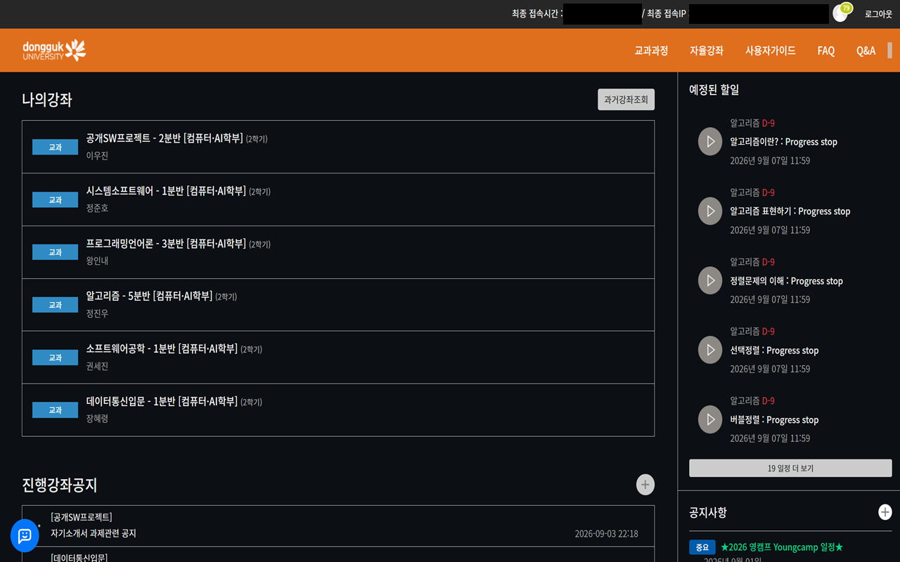

# 동국대학교 e-Class 다크 테마

동국대학교 e-Class에 **다크 테마를 적용하는 Chrome 확장 프로그램**입니다.

야간 학습 시 눈의 피로를 줄이고, 보다 편안하게 e-Class를 이용할 수 있도록 제작했습니다.

---

## 미리보기



## 주요 기능

- 동국대학교 e-Class 다크 테마 적용
- e-Class 접속 시 자동으로 테마 적용
- 간단하고 가벼운 확장 프로그램

---

## 설치 방법

### Chrome 웹 스토어

가장 간단한 방법은 Chrome 웹 스토어를 통해 설치하는 것입니다.

👉 [Chrome 웹 스토어에서 설치하기](https://chromewebstore.google.com/detail/jmjccgnogpafmkcgclgiffifjnkkgedg)

**Chrome에 추가** 버튼을 클릭하면 확장 프로그램이 설치되며,
동국대학교 e-Class에 접속했을 때 다크 테마가 자동으로 적용됩니다.

---

### 로컬 설치

GitHub에서 소스 코드를 다운로드하여 직접 설치할 수도 있습니다.

1. 이 저장소를 다운로드하거나 Clone합니다.
2. Chrome 주소창에 다음 주소를 입력합니다.

   ```
   chrome://extensions/
   ```


3. 오른쪽 상단의 **개발자 모드**를 활성화합니다.
4. **압축해제된 확장 프로그램을 로드합니다.** 버튼을 클릭합니다.
5. 다운로드한 프로젝트 폴더를 선택합니다.

설치가 완료되면 동국대학교 e-Class에 다크 테마가 자동으로 적용됩니다.

---

## 사용 방법

확장 프로그램을 설치한 후 동국대학교 e-Class에 접속하면 됩니다.

별도의 설정 없이 다크 테마가 자동으로 적용됩니다.

---

## 라이선스

이 프로젝트는 개인 및 교육 목적으로 제작되었습니다.


# Dongguk University e-Class Dark Theme

A Chrome extension that applies a dark theme to **Dongguk University's e-Class**.

Designed for a more comfortable viewing experience, especially when studying at night.

---

## Preview


## Features

- Dark theme for Dongguk University e-Class
- Automatic theme application
- Simple and lightweight

---

## Installation

### Chrome Web Store

The easiest way to install the extension is through the Chrome Web Store.

👉 [Install from the Chrome Web Store](https://chromewebstore.google.com/detail/jmjccgnogpafmkcgclgiffifjnkkgedg)

Click **Add to Chrome**, and the dark theme will be automatically applied to Dongguk University's e-Class.

---

### Local Installation

You can also install the extension manually from the source code.

1. Download or clone this repository.
2. Open the following page in Chrome:

   ```
   chrome://extensions/
   ```

3. Enable **Developer mode** in the top-right corner.
4. Click **Load unpacked**.
5. Select the downloaded project folder.

The extension will now be installed and applied to Dongguk University's e-Class.

---

## Usage

Once installed, simply visit Dongguk University's e-Class.

The dark theme will be applied automatically.

---

## License

This project is intended for personal and educational use.
